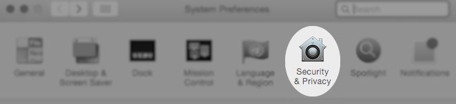
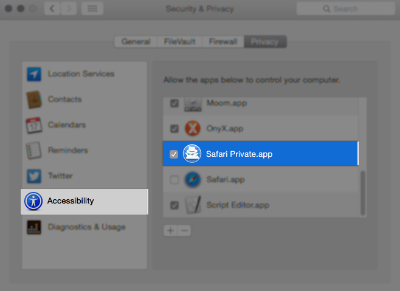

# safari-private
Instantly make the current page private.

# usage
To go private: launch application, the current tab will be reopened in a private window. 

##note
All other tabs besides the current window will be closed.


# install
Copy the app from the dmg, and add the app to assistive devices.





# implementation

```applescript

property theURL : ""

tell application "Google Chrome"
	activate		
end tell

try
	tell application "System Events"
		tell application "Google Chrome"
			
			set theURL to URL of tab of window 1
		end tell
	end tell
	
on error errStr number errorNumber
	set errored to true
	sleep(2)
end try


try
	get theURL
on error
	set theURL to "about:blank"
end try


tell application "System Events"
	tell process "Google Chrome"
		click menu item "Close All" of menu "File" of menu bar 1
		click menu item "New Incognito Window" of menu "File" of menu bar 1
	end tell
end tell
	
tell application "Google Chrome"
	tell window 1
		open location theURL
	end tell
	activate	
end tell


```
